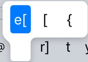
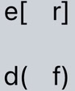

<p align="center">
iPhone keyboard layouts experimenting with improved ergonomics
<br>
(using <a href="https://apps.apple.com/us/app/xkeyboard-custom-keyboard/id1440245962">xKeyboard</a> $app)
</p>

<p align="center">  
</p>


## Introduction
#### Disorganized list of design principles
  - no Capitalization in on-hold popup menus: ⇧ is more convenient, so this just wastes space 
    - ❗ but a ↑gesture would work even better (not suppoted)
  - paired symbols at physically paired keys 
  - Easy entry of similar symbols via circular entry (so that you can always return if you overtap), e.g.,
    - tap `-` key multiple times to cycle through hyphen-minus/en-dash/em-dash `-` `–` `–`: easy
    - tap `$` key multiple times to cycle through `$` `€` `₽` (hold for a longer list; change the rules to your 3 favorite currencies and replace the base key from `$` to your most frequently used, current layout uses `₽` as the base)
  - smaller Spacebar, it doesn't need to repeat the waste of physical keyboards and be huge
  - fixing typos is common, so <kbd>⌫</kbd> should be more convenient - left of 🖒thumb's resting place (mnemonic: move left to remove left char)

##### Punctuation
  - Quick punctuation entry via 2 taps of nearby keys:
    - <kbd>,</kbd><kbd>.</kbd> → `;` (visual mnemonic)
    - <kbd>.</kbd><kbd>,</kbd> → `:`
    - <kbd>,</kbd><kbd>=</kbd> → `?` (or <kbd>.</kbd><kbd>-</kbd>)
    - <kbd>.</kbd><kbd>=</kbd> → `!`
    - see `Environment`→`Input Rules` for the full list

##### Numpad
  - Dumb `1234567890` row placement replaced with a numpad-like table
    ```
    y₋ u₁ i₂ o₃ p₊
       h₄ j₅ k₆ l*
       b₇ n₈ m₉ "/
    ```
  - Quick single number entry without switching to a dedicated big layout via <kbd>,</kbd><kbd>U</kbd>… sequence
  - Quick continuous number entry: numpad "mode" remains active a long as the previous symbols is a number/numeric sign (`+-/` or figure␠ ` ` (TBD))
    - double ␠bar exist since you are unlikely to need two figure␠ `  ` in numeric entry

## Install

Zip contents of a subfolder (not the subfolder) inside [xKeyboard](./xKeyboard), change extension from `.zip` to `.xkeyboard`, copy to phone, and import from the app

## Modify

  - Sequence rules in `Environment\Environment.plist`, e.g., for `,.`→`;`
    ```xml
    <dict><key>type</key><integer>0</integer><key>input1</key>
    <string>,</string><key>input2</key>
    <string>.</string><key>output</key>
    <string>;</string></dict>
    ```


## Use

## Known issues


## xKeyboad limitations

  - ❗ Deal-breaker: no swipe input support
  - No swipe gesture support, so no ↑swipe to Capitalize
  - No custom popup menu layout so you could have a 3⋅3 grid and
    - hold+swipe↘ to insert `◌̀`
    - hold+swipe↙ to insert `◌́`
    for 2D-mnenomic entry of diacritics
  - No way to have a more ergonomic ~hex-like key positioning, only strict|- grid is allowed
  - Keys with 2 labels suffer in legibility because you can't position labels at arbitrary location with arbitrary colors
  - No convenient arbitrary symbol insert due to a lack of search, requiring adding limited symbol sets (see `🔣Chars` layout)

## Credits
